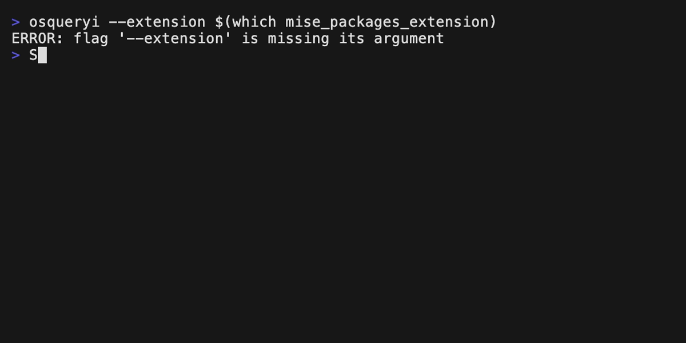
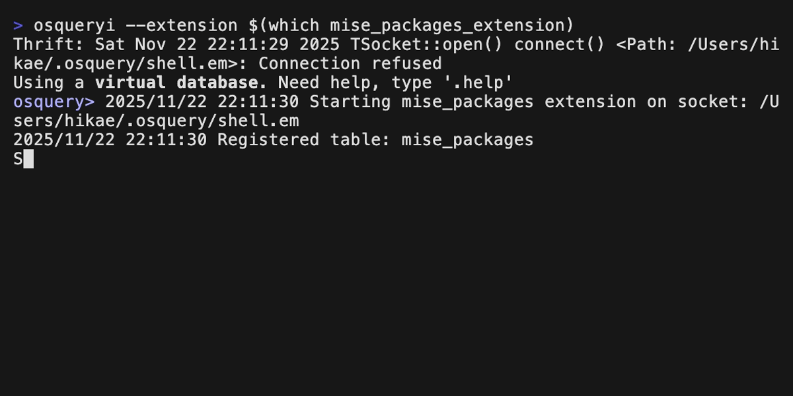

# osquery Version Manager Packages Extension

osquery extension written in Go to discover installed packages from version managers (mise, asdf).

## Installation

```bash
mise use -g github:HikaruEgashira/mise-osquery-extension

# Linux
sudo chown root:root $(which mise_packages_extension)
sudo chmod 755 $(which mise_packages_extension)

# macOS
sudo chown root:wheel $(which mise_packages_extension)
sudo chmod 755 $(which mise_packages_extension)
```

For other installation methods, see the [releases page](https://github.com/HikaruEgashira/mise-osquery-extension/releases).

## Quick Start


```bash
osqueryi --extension $(which mise_packages_extension)
> SELECT tool, version, manager FROM mise_packages;
```

## Features

| Version Manager | Install Locations                                    | Supported |
|-----------------|------------------------------------------------------|-----------|
| mise            | `~/.local/share/mise/installs`, `$MISE_DATA_DIR`     | Yes       |
| asdf            | `~/.asdf/installs`, `$ASDF_DATA_DIR`                 | Yes       |

## Table Schema

```sql
CREATE TABLE mise_packages (
    tool TEXT,
    version TEXT,
    manager TEXT,
    install_path TEXT
);
```

- `tool`: Tool name (e.g., node, python, ruby, go)
- `version`: Tool version (e.g., 20.10.0, 3.12.0)
- `manager`: Version manager (mise, asdf)
- `install_path`: Path to the installation directory

## Query Examples

### Query all packages



```sql
SELECT * FROM mise_packages;
```

### Query packages by manager



```sql
SELECT tool, version FROM mise_packages WHERE manager = 'mise';
```

### Count packages per manager


```sql
SELECT manager, COUNT(*) as count FROM mise_packages GROUP BY manager;
```

### Find specific tool versions


```sql
SELECT * FROM mise_packages WHERE tool LIKE '%node%';
```

### List unique tools


```sql
SELECT DISTINCT tool FROM mise_packages ORDER BY tool;
```

See [example_queries.sql](example_queries.sql) for more SQL query examples.

## Contributing

See [CONTRIBUTING.md](CONTRIBUTING.md) for detailed guidelines.

## License

MIT
